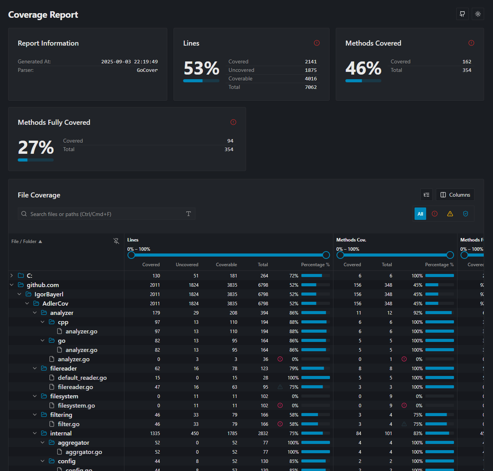
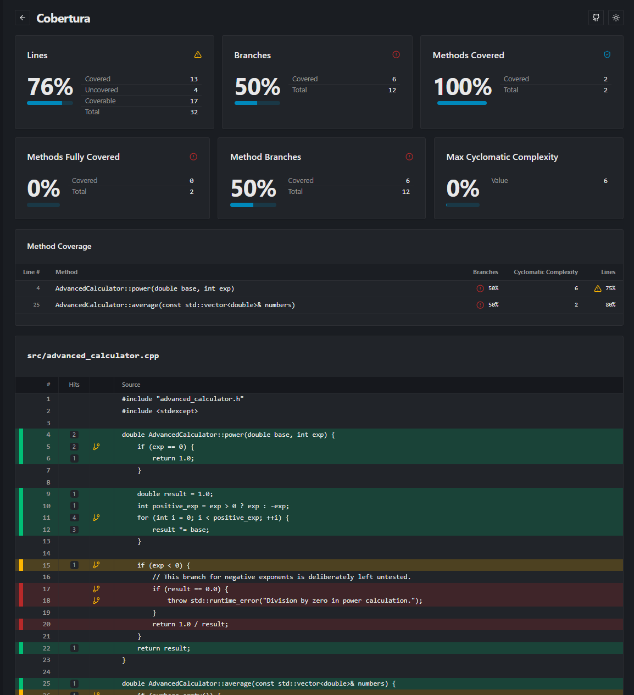

<h1 align="center">


<br/>
AdlerCov
</h1>


<div align="center">
    
<b>Powerful code coverage visualization</b>
  
</div>

[](https://goreportcard.com/report/github.com/IgorBayerl/AdlerCov)

**AdlerCov** converts coverage reports generated by Cobertura, GoCover or GCov into human-readable reports in various formats.

The reports show the coverage quotas and also visualize which lines of your source code have been covered.

**AdlerCov** supports merging several coverage files into a single report, giving you a unified view of your project's test coverage across different test suites (e.g., unit and integration tests).

Originally a Go port of the excellent [ReportGenerator](https://github.com/danielpalme/ReportGenerator) by Daniel Palme, **AdlerCov** has evolved into something different. Built in Go, it focuses on performance, simplicity, and a clean architecture tailored for today’s development workflows.


## Motivation

[ReportGenerator](https://github.com/danielpalme/ReportGenerator) is a mature and feature-rich tool that has served the .NET ecosystem for over **14 years**. Its robustness and design inspired this project.

The motivations for creating **AdlerCov**:

1.  **For Study:** To explore the architectural challenges of translating a large project to a new language while keeping the result idiomatic and aligned with modern best practices of the target language.
2.  **Dependency-Free:** A lightweight, native binary that runs anywhere without external runtimes—ideal for containers and CI/CD pipelines.
3.  **Modern Extensibility:** Designed with a clean, multi-stage pipeline in Go, enabling rapid extension for new report formats and language-specific analysis.

## Screenshots


### HTML Report

Summary


Details

## Feature Status


While AdlerCov began by mirroring ReportGenerator’s capabilities, it is now diverging with Go-native enhancements and a growing list of planned features.

| Feature Category   | Feature               | ReportGenerator | AdlerCov | Notes                  |
|:-------------------|:----------------------|:---------------:|:--------:|:-----------------------|
| **Input Formats**  | Cobertura             |        ✅        |    ✅     | Core support.          |
|                    | Go Cover              |        ❌        |    ✅     |                        |
|                    | OpenCover             |        ✅        |    ❌     | Planned.               |
|                    | JaCoCo                |        ✅        |    ❌     | Planned.               |
|                    | Merge Reports         |        ✅        |    ✅     |                        |
| **Output Formats** | HTML (SPA)            |        ✅        |    ✅     | Angular frontend.      |
|                    | TextSummary           |        ✅        |    ✅     | Fully supported.       |
|                    | lcov                  |        ✅        |    ✅     | Fully supported.       |
|                    | RawJSON               |        ✅        |    ✅     | Coming soon.           |
|                    | Badge                 |        ✅        |    ❌     | Coming soon.           |
|                    | XML                   |        ✅        |    ❌     | Coming soon.           |
| **Core Features**  | File Filtering        |        ✅        |    ✅     |                        |
|                    | Branch Coverage       |        ✅        |    ✅     |                        |
|                    | Method Coverage       |        ✅        |    ✅     |                        |
|                    | Cyclomatic Complexity |        ✅        |    ✅     | Go-native; C++/C# WIP. |
|                    | History Charts        |        ✅        |    ❌     | Coming soon.           |
|                    | Patch Coverage        |        ✅        |    ❌     | Coming soon.           |
|                    | Risk Hotspots         |        ✅        |    ❌     | Coming soon.           |

## Command Line Interface

AdlerCov mirrors the familiar command-line interface of ReportGenerator while following idiomatic Go CLI patterns.

| Argument      | AdlerCov | Description                                   |
|:--------------|:--------:|:----------------------------------------------|
| `report`      |    ✅     | Input coverage reports (semicolon-separated). |
| `output`      |    ✅     | Output directory.                             |
| `sourcedirs`  |    ✅     | Source directories (semicolon-separated).     |
| `reporttypes` |    ✅     | Output formats (comma-separated).             |
| `filefilters` |    ✅     | Include/exclude file filters.                 |
| `verbosity`   |    ✅     | Log level (e.g., Verbose, Info, Error).       |
| `tag`         |    ✅     | Optional label for the report.                |
| `title`       |    ✅     | Custom report title.                          |
| `historydir`  |    ❌     | TODO                                          |

## Why "AdlerCov"?

The name **AdlerCov** combines **“Adler”** (German for **eagle**) with **coverage**, evoking the image of a high-flying, sharp-eyed bird analyzing your entire codebase. It reflects the project's mission: to help developers detect weaknesses and gaps in their test coverage with clarity and accuracy.

## How to Contribute

This project is actively evolving. Your contributions are highly valued! Whether you're adding new input formats, improving a language processor, or enhancing the documentation, I would love your help.

### System Design

AdlerCov is built around a clean, four-stage pipeline that makes it easy to extend and maintain.

*   **1. Parsing (`internal/parsers`):** Each parser has one job: to translate a specific report format (like Cobertura XML) into a standardized, raw `ParserResult` struct. It extracts line and branch hits but does no further analysis.

*   **2. Tree Building (`internal/tree`):** The `TreeBuilder` takes all the `ParserResult` and merges them into a single, hierarchical `SummaryTree`. This tree mirrors the project's file structure and correctly sums coverage data for files that appear in multiple reports. The tree is still "raw" at this stage with just Line and Branch coverage extracted from the report.

*   **3. Hydration (`internal/hydrator`):** The `Hydrator` takes the raw tree and enriches it. For each file, it reads the source code, uses a `language.Processor` to perform static analysis (like finding method boundaries and calculating cyclomatic complexity), and populates the tree with this rich data.

*   **4. Reporting (`internal/reporter`):** The final, hydrated `SummaryTree` is passed to one or more `Reporter` components. Each reporter is responsible for transforming this complete data model into a user-facing format, like an HTML report or a text summary.

This modular design ensures that each component has a single and clear responsibility.


## Getting Started & Development

This section guides you through setting up the project for local development and contribution.

### Development Environment Prerequisites

To work on this project, you will need certain tools installed depending on what you want to do.

*   **Go (Required):** You must have Go version 1.23 or higher installed to build and run the core AdlerCov application.
*   **Python (Optional):** Needed to run the `generate_reports.py` script located in the `Testprojects` directory. This script is used to generate sample coverage reports for testing.
*   **Node.js & Angular CLI (Optional):** If you plan to modify the frontend of the HTML report, you will need Node.js and the Angular CLI to build the Angular single-page application located in the `internal/assets/angular_frontend_spa` directory.
*   **.NET SDK (Optional):** Required by the `generate_reports.py` script to build the C# test project and generate its coverage data.

### 1. Clone the Repository

First, clone the project to your local machine using git:

```bash
git clone https://github.com/IgorBayerl/AdlerCov.git
cd AdlerCov
```

### 2. Run Locally

You can run the application directly without building a binary using `go run`. This is the recommended approach for development and quick testing.

To see all available command-line flags:
```bash
go run ./cmd/main.go --help
```

To run with a sample report (you may need to generate it first using the `generate_reports.py` script):
```bash
go run ./cmd/main.go --report="Testprojects/Go/coverage.cobertura.xml" --output="reports/go_report"
```

### 3. Build the Binary

To compile the project into a single executable binary, use the `go build` command:

Linux / Mac
```bash
go build -o adlercov ./cmd/main.go
```

Windows
```powershell
go build -o adlercov.exe ./cmd/main.go
```
This will create an executable file named `adlercov` (or `adlercov.exe` on Windows) in the root directory. You can then run it directly:

```bash
./adlercov --report="path/to/your/coverage.xml" --output="your_report_directory"
```

### Feature Requests

If you're missing a feature from the original ReportGenerator or have new ideas, please [open an issue](https://github.com/IgorBayerl/AdlerCov/issues) and include:

1. Feature description
2. Reference (link or example from ReportGenerator)
3. Sample CLI usage
4. Sample input/output if possible

This context makes implementation much smoother.


## License
- **AdlerCov** is licensed under the [Apache License, Version 2.0](https://opensource.org/licenses/Apache-2.0)